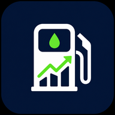

# appGas

<p align="center">
  
</p>

<p align="center">
  Controla tus cargas de gasolina, el gasto real y el rendimiento de cada recorrido desde una sola app.
</p>

<p align="center">
  
  
  
  
</p>

## De que va

`appGas` es una app hecha con Expo para registrar cargas de gasolina, asociarlas a vehiculos y convertir esos datos en indicadores utiles:

- cuanto llevas gastado
- cuantos litros has cargado
- cual es tu precio promedio por litro
- como cambia tu rendimiento en km/L
- cuanto te cuesta realmente cada km

La app corre en `iOS`, `Android` y `web`, usa `Expo Router` para navegacion por archivos y conserva la sesion del usuario con `AsyncStorage`.

## Lo que ya incluye

- Login y registro con persistencia de sesion.
- Dashboard con resumen total, gasto mensual, litros mensuales, rendimiento y costo por km.
- Registro de cargas con fecha, odometro, litros, precio por litro, notas y bandera de tanque lleno.
- Gestion de vehiculos con nombre y capacidad de tanque.
- Historial de cargas con eliminacion en dos pasos para evitar borrados accidentales.
- Export web estatico via `expo export`.

## Flujo de uso

1. El usuario crea cuenta o inicia sesion.
2. Agrega uno o varios vehiculos.
3. Registra cada carga de gasolina.
4. Consulta el dashboard para ver tendencias y eficiencia.

## Pantallas principales

- `src/app/login.tsx`: acceso de usuarios.
- `src/app/register.tsx`: alta de cuenta con validaciones.
- `src/app/tabs/dashboard.tsx`: metricas y graficas.
- `src/app/tabs/registro.tsx`: captura de nuevas cargas.
- `src/app/tabs/historial.tsx`: consulta y eliminacion de registros.
- `src/app/tabs/vehiculos.tsx`: alta y listado de vehiculos.
- `src/app/tabs/perfil.tsx`: datos del usuario y cierre de sesion.

## Stack

| Capa | Herramientas |
| --- | --- |
| App | Expo `~56.0.8`, React Native `0.85.3`, React `19.2.3` |
| Navegacion | `expo-router ~56.2.8` |
| Estado de sesion | Context API + `@react-native-async-storage/async-storage` |
| UI | `lucide-react-native`, `expo-image`, `expo-glass-effect`, `@expo/ui` |
| Visualizacion | `react-native-chart-kit`, `react-native-svg`, `react-native-calendars` |
| Plataformas | Android, iOS y web con `react-native-web` |

## Estructura

```text
src/
  app/
    _layout.tsx
    index.tsx
    login.tsx
    register.tsx
    tabs/
      _layout.tsx
      dashboard.tsx
      registro.tsx
      historial.tsx
      vehiculos.tsx
      perfil.tsx
  components/
  constants/
  contexts/
  hooks/
  lib/
  types/
assets/
public/
scripts/
```

## Setup rapido

### 1. Instala dependencias

```bash
npm install
```

### 2. Configura la URL del backend

Crea un archivo `.env` en la raiz:

```bash
EXPO_PUBLIC_API_URL=http://127.0.0.1:8787
```

Si vas a probar la app desde un telefono fisico, no uses `127.0.0.1`. Cambialo por la IP local de tu maquina, por ejemplo:

```bash
EXPO_PUBLIC_API_URL=http://192.168.1.20:8787
```

Si no defines esa variable, la app usa por defecto `http://127.0.0.1:8787`.

### 3. Levanta la app

```bash
npm run start
```

Tambien puedes abrir directo por plataforma:

```bash
npm run android
npm run ios
npm run web
```

## Scripts utiles

| Comando | Que hace |
| --- | --- |
| `npm run start` | Inicia Expo |
| `npm run android` | Abre el proyecto en Android |
| `npm run ios` | Abre el proyecto en iOS |
| `npm run web` | Abre la version web |
| `npm run build:web` | Genera export estatico en `dist/` |
| `npm run lint` | Ejecuta `expo lint` |
| `npm run reset-project` | Resetea el proyecto base de Expo |

## API esperada

La app hoy consume estos endpoints:

| Metodo | Ruta | Uso |
| --- | --- | --- |
| `POST` | `/auth/register` | Crear cuenta |
| `POST` | `/auth/login` | Iniciar sesion |
| `GET` | `/api/me` | Obtener usuario autenticado |
| `GET` | `/api/vehicles` | Listar vehiculos |
| `POST` | `/api/vehicles` | Crear vehiculo |
| `GET` | `/api/gas-records` | Listar cargas |
| `POST` | `/api/gas-records` | Crear carga |
| `DELETE` | `/api/gas-records/:id` | Eliminar carga |
| `GET` | `/api/stats` | Obtener resumen y eficiencia |

## Notas de Expo

- Este proyecto esta montado sobre `Expo SDK 56`.
- Si vas a tocar configuracion, router o build, usa la documentacion versionada: `https://docs.expo.dev/versions/v56.0.0/`
- En SDK 55+ `src/app` es una estructura valida para Expo Router sin configuracion extra, y este proyecto ya sigue ese esquema.
- La salida web esta configurada como `static` en `app.json`.

## Idea de producto

`appGas` no busca solo guardar tickets. Busca convertir cada carga en una lectura clara del costo real de mover un vehiculo. Si el usuario captura bien fecha, litros, precio y odometro, el dashboard deja de ser decoracion y se vuelve una herramienta de control.
